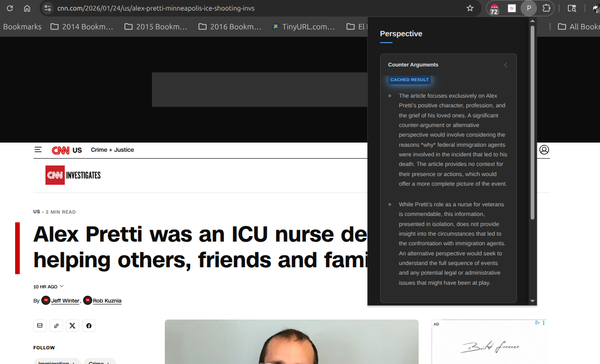
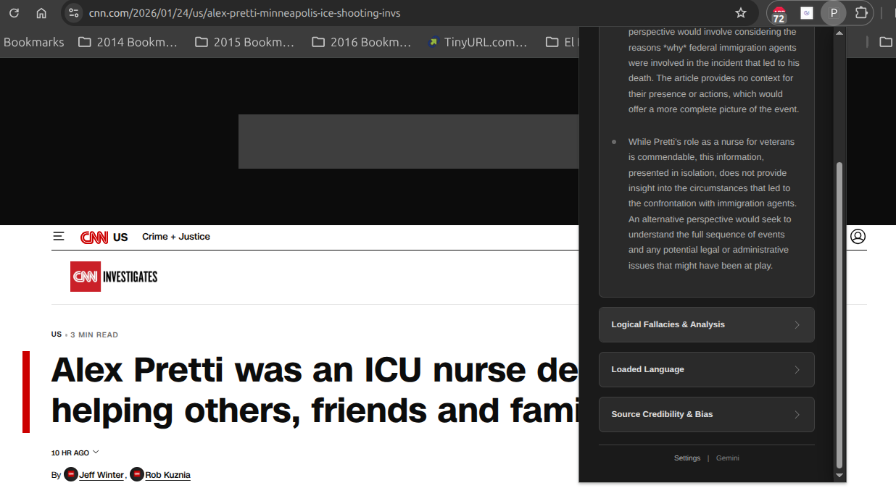
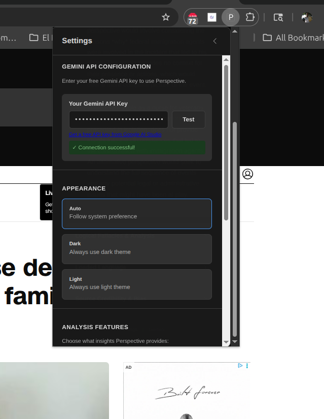
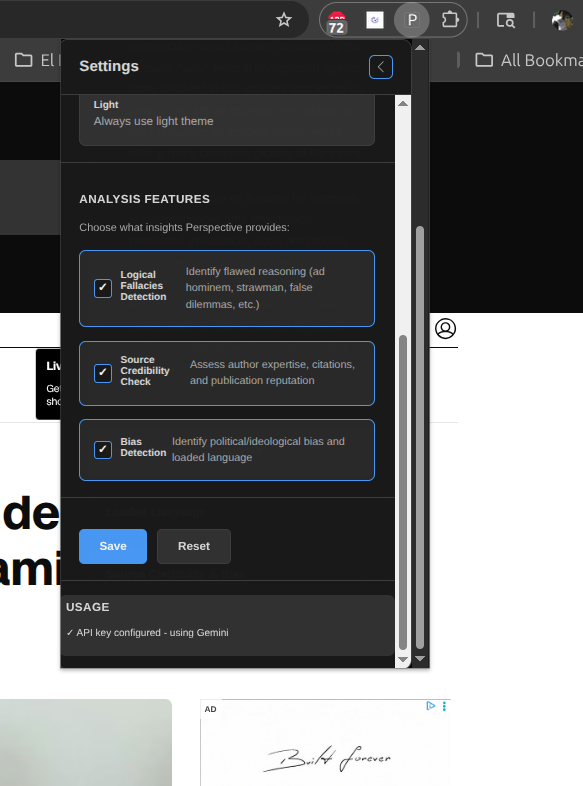

# Perspective - Critical Thinking Chrome Extension

Perspective is a Chrome extension that acts as your personal critical thinking coach. When you encounter articles online, Perspective analyzes the content and provides:

- **Counter Arguments** - Alternative perspectives and opposing viewpoints
- **Logical Fallacies** - Identifying flawed reasoning patterns
- **Loaded Language** - Emotionally charged wording detection
- **Source Credibility** - Assessment of author expertise and potential bias

## Getting Started

### Prerequisites

- Google Chrome browser
- A free Google Gemini API key

### Installation

1. **Clone or download this repository**
   ```bash
   git clone https://github.com/MuataSr/perspective-browser-extension.git
   ```

2. **Load the extension in Chrome**
   - Open Chrome and navigate to `chrome://extensions/`
   - Enable "Developer mode" (toggle in the top-right corner)
   - Click "Load unpacked"
   - Select the `perspective-extension` folder

3. **Get your free Gemini API key**
   - Click the Perspective extension icon
   - Click "Settings" in the footer
   - Click "Get a free API key from Google AI Studio"
   - Sign in with your Google account and create an API key
   - Copy the key and paste it into the Settings input field
   - Click "Test Connection" to verify
   - Click "Save"

### Usage

1. Navigate to any article webpage
2. Click the Perspective extension icon in your browser toolbar
3. Perspective will analyze the article and display:
   - Counterarguments and alternative perspectives
   - Logical fallacies detected
   - Loaded language used
   - Source credibility assessment

## Screenshots


*The main popup showing analysis results with counterarguments and fallacies detected*


*Dark mode support for comfortable viewing in any lighting*


*Settings page for configuring your free Gemini API key*


*Appearance settings with auto, dark, and light mode options*

## How It Works

Perspective uses Google's Gemini AI model to analyze article content. The extension:

1. Extracts the main text from the webpage using Mozilla's Readability.js
2. Sends the content to Gemini for analysis
3. Parses and formats the AI's response
4. Displays results in an organized, accordion-style interface

### Privacy

- Your API key is stored locally in Chrome's extension storage
- Article content is sent only to Google's Gemini API for analysis
- No data is collected or stored on external servers

## Free Tier Limits

Google's Gemini API free tier includes:
- **15 requests per minute**
- **1 million tokens per day**

This is more than sufficient for regular daily use.

## Files

```
perspective-extension/
├── manifest.json          # Chrome extension configuration
├── background.js          # Service worker - handles API calls
├── popup.html             # Extension popup UI
├── popup.js               # Popup logic and event handling
├── popup.css              # Popup styling
├── settings.html          # Settings page UI
├── settings.js            # Settings logic
├── settings.css           # Settings styling
├── perspectiveui.png      # Screenshot: Main UI (light mode)
├── perspectiveui2.png     # Screenshot: Main UI (dark mode)
├── perspectivesettings1.png  # Screenshot: Settings API config
├── perspectivesettings2.png  # Screenshot: Settings theme options
├── README.md              # This file
└── lib/
    └── Readability.js     # Mozilla's content extraction library
```

## Development

### Running Locally

1. Make changes to any file
2. Reload the extension in `chrome://extensions/`
3. Test in browser

### Building

No build process required - this is a pure JavaScript extension using vanilla Chrome APIs.

## Version History

- **v0.6.0** - Switched to Google Gemini API (user-provided keys)
- **v0.5.0** - Added dark mode support
- **v0.4.0** - Added settings panel with feature toggles
- **v0.3.0** - Implemented accordion UI for results
- **v0.2.0** - Added logical fallacy detection
- **v0.1.0** - Initial release with basic counterarguments

## License

This project is open source and available under the MIT License.

## Contributing

Contributions are welcome! Feel free to open issues or submit pull requests.

## Acknowledgments

- [Google Gemini](https://gemini.google.com/) - AI model
- [Mozilla Readability](https://github.com/mozilla/readability) - Content extraction
